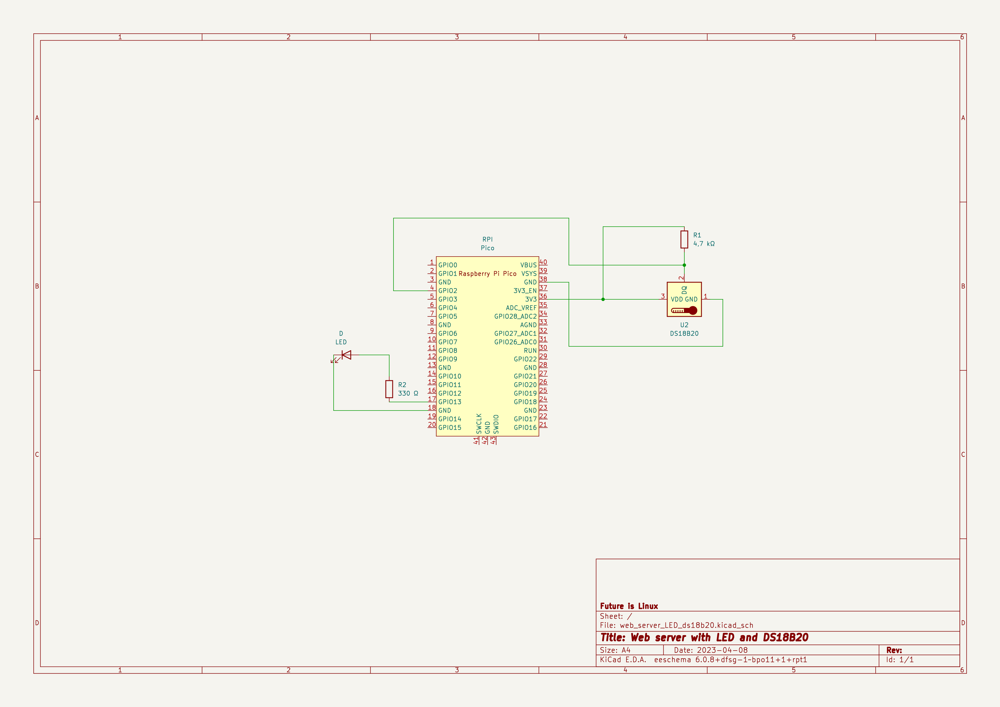

# Web server with DS18B20 and LED 

Build web server on RPI Pico W. Check temperature with DS18B20 sensor and light on your LED diode !

# For this project you need this:
## Software:
picozero.py - A beginner-friendly library to help you use common electronics components with the Raspberry Pi Pico. 
https://github.com/RaspberryPiFoundation/picozero/blob/master/picozero/picozero.py

ds18x20.py - Driver for your temperature sensor

https://github.com/micropython/micropython-infineon/blob/master/drivers/onewire/ds18x20.py

onewire.py - Next driver for your ds18x20 sensor

https://github.com/micropython/micropython-infineon/blob/master/drivers/onewire/onewire.py

## Hardware:
1x LED diode

1x 330 Ω resistor

1x 4,7 kΩ resistor

1x DS18B20 temperature sensor

and of course Raspberry Pi W

# Let's do this !

First you must connect all. Check image how to do this.

Download all drivers and libraries. Save them into rpi pico.

Use my `main.py` code. Change WIFI ssid and password. Now you can run it ! 

You should see blinking onboard led. It means that your rpi pico w try connect to internet. 

And the last signal is blink your LED diode on GPIO13. It means that your rpi pico successfully connected and now you can see rpi IP address. Copy it and paste in your web browser. 

It's that moment ! You see your website ! 

Click buttons and check that your LED diode is ON or OFF. 

Refresh website to see actual temperature from your DS18B20 sensor.
## Authors

- [@bold663key](https://www.github.com/bold663key)

## License

[MIT](https://choosealicense.com/licenses/mit/)

